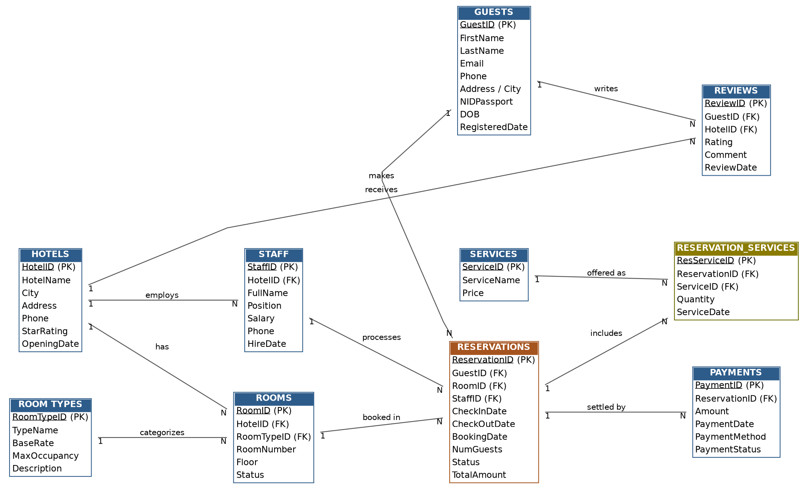

# 🏨 Hotel Reservation System

### A Relational Database Design & SQL Implementation Project

A complete **Hotel Reservation System** developed as a Database Management Systems (DBMS) project using **MySQL**. The system is designed to manage hotels, rooms, guests, reservations, staff, payments, optional services, reviews, and management reports through a structured relational database.

---

## 📌 Project Overview

Traditional hotel reservation processes can result in double bookings, inconsistent customer records, incorrect payment information, and inefficient report generation.

This project provides a relational database solution that organizes the complete reservation lifecycle, from guest registration and room booking to payment, services, reviews, check-in, check-out, and cancellation.

The project demonstrates practical implementation of major DBMS concepts including:

* Relational database design
* ER modeling
* Primary and foreign keys
* Normalization up to 3NF
* DDL and DML
* SQL constraints
* Joins
* Aggregate functions
* Subqueries
* Views
* Functions
* Stored procedures
* Triggers
* Referential integrity
* Management reports

The report describes **11 relational tables**, including the `ReservationAudit` table used by the deletion trigger.

---

## 🎯 Objectives

The main objectives of the system are to:

* Manage multiple hotel properties and their rooms.
* Maintain different room categories and pricing.
* Store complete guest information.
* Manage the complete reservation lifecycle.
* Track check-in, check-out, and cancellation.
* Manage reservation payments and part-payments.
* Provide optional paid services such as breakfast, laundry, and spa.
* Store and manage guest reviews.
* Generate useful hotel management reports.
* Demonstrate important DBMS concepts through working SQL implementation.

These objectives are directly aligned with the project's DBMS requirements.

---

## ✨ Key Features

* 🏨 Hotel branch management
* 🛏️ Room and room-type management
* 👤 Guest registration
* 📅 Room reservation
* 🔄 Reservation status management
* 💳 Payment management
* 👨‍💼 Staff management
* ⭐ Guest review management
* 🔎 Available room search
* 📊 Monthly reservation reports
* 💰 Payment and revenue summaries
* 📜 Guest booking history
* 🧮 Automatic reservation cost calculation
* 🚫 Duplicate room prevention
* 🔐 Referential integrity using foreign keys
* ⚡ Automated operations using triggers

The project report specifically identifies duplicate-booking prevention, room availability, payment management, reporting, and booking history among the implemented features.

---

## 🗃️ Database Architecture

### ER Diagram

The system contains the following major entities:

```text
                    ┌─────────────┐
                    │   HOTELS    │
                    └──────┬──────┘
                           │
              ┌────────────┼────────────┐
              │            │            │
              ▼            ▼            ▼
          ┌───────┐    ┌───────┐    ┌────────┐
          │ ROOMS │    │ STAFF │    │REVIEWS │
          └───┬───┘    └───┬───┘    └────────┘
              │            │
              │            │
              ▼            ▼
        ┌────────────────────────┐
        │     RESERVATIONS       │
        └──────┬─────────┬───────┘
               │         │
        ┌──────▼───┐ ┌───▼──────────────┐
        │ PAYMENTS │ │ RESERVATION_     │
        │          │ │ SERVICES         │
        └──────────┘ └───────┬──────────┘
                             │
                             ▼
                         ┌──────────┐
                         │ SERVICES │
                         └──────────┘

ROOM TYPES ────────► ROOMS
GUESTS ────────────► RESERVATIONS
GUESTS ────────────► REVIEWS
```

### ER Diagram Image



---

## 🧩 Database Entities

| Table                 | Purpose                                           |
| --------------------- | ------------------------------------------------- |
| `Hotels`              | Stores hotel branch information                   |
| `RoomTypes`           | Stores room categories, rates, and occupancy      |
| `Rooms`               | Stores individual room information                |
| `Guests`              | Stores guest/customer information                 |
| `Staff`               | Stores hotel employee information                 |
| `Reservations`        | Manages room reservations                         |
| `Payments`            | Records reservation payments                      |
| `Services`            | Stores additional hotel services                  |
| `ReservationServices` | Resolves the reservation-service M:N relationship |
| `Reviews`             | Stores guest reviews                              |
| `ReservationAudit`    | Records deleted reservation information           |

The project uses primary keys for entity identification and foreign keys to establish relationships between related tables.

---

## 🔗 Relationship Summary

| Relationship            | Cardinality | Description                                      |
| ----------------------- | ----------: | ------------------------------------------------ |
| Hotels → Rooms          |         1:N | One hotel has many rooms                         |
| RoomTypes → Rooms       |         1:N | One room type applies to many rooms              |
| Hotels → Staff          |         1:N | One hotel employs many staff                     |
| Hotels → Reviews        |         1:N | One hotel receives many reviews                  |
| Guests → Reservations   |         1:N | One guest can make many reservations             |
| Guests → Reviews        |         1:N | One guest can write many reviews                 |
| Rooms → Reservations    |         1:N | A room can appear in many reservations over time |
| Staff → Reservations    |         1:N | One staff member can process many reservations   |
| Reservations → Payments |         1:N | One reservation can have several payments        |
| Reservations ↔ Services |         M:N | Implemented through `ReservationServices`        |

---

## 🏗️ Normalization

The database design follows **Third Normal Form (3NF)**.

### 1NF

All tables contain atomic values and avoid repeating groups. The many-to-many relationship between reservations and services is separated into the `ReservationServices` junction table.

### 2NF

The tables use single-column surrogate primary keys, so there are no partial dependencies on composite keys.

### 3NF

Non-key attributes do not depend on other non-key attributes. For example, room type information is stored in `RoomTypes` rather than being duplicated inside `Rooms`.

`Reservations.TotalAmount` is intentionally stored as a derived value for reporting performance and is automatically maintained through a trigger.

---

## 🛠️ Technologies Used

* **Database:** MySQL
* **Language:** SQL
* **ER Modeling:** Graphviz
* **Database Concepts:** Relational Modeling, Normalization, Constraints, Joins, Views, Functions, Procedures, Triggers
* **Documentation:** Markdown / PDF

---

## 📊 Database Statistics

The project contains **179 sample rows** distributed across the database:

| Data            | Quantity |
| --------------- | -------: |
| Hotels          |        5 |
| Room Types      |        5 |
| Rooms           |       30 |
| Guests          |       20 |
| Staff           |       15 |
| Reservations    |       30 |
| Payments        |       25 |
| Services        |        8 |
| Service Add-ons |       26 |
| Reviews         |       15 |
| **Total**       |  **179** |

The dataset exceeds the assignment requirements specified in the project report.

---

## 🔐 Constraints & Data Integrity

The database uses several SQL constraints to maintain data integrity:

* `PRIMARY KEY`
* `FOREIGN KEY`
* `NOT NULL`
* `UNIQUE`
* `CHECK`
* `DEFAULT`
* `AUTO_INCREMENT`

Example:

```sql
CREATE TABLE Hotels (
    HotelID INT AUTO_INCREMENT PRIMARY KEY,
    HotelName VARCHAR(100) NOT NULL,
    City VARCHAR(50) NOT NULL,
    Phone VARCHAR(20) NOT NULL UNIQUE,
    StarRating TINYINT NOT NULL DEFAULT 3
        CHECK (StarRating BETWEEN 1 AND 5),
    OpeningDate DATE NOT NULL
);
```

Foreign-key relationships also use appropriate referential actions such as `ON DELETE CASCADE` and `ON DELETE SET NULL`.

---

## ⚙️ SQL Features Implemented

### DDL

Database and table creation are implemented using commands such as:

```sql
CREATE DATABASE
CREATE TABLE
```

### DML

The project includes:

```sql
INSERT
UPDATE
DELETE
```

The implementation contains **6 UPDATE statements** and **4 DELETE statements**.

### Joins

Implemented join types include:

* INNER JOIN
* LEFT JOIN
* RIGHT JOIN
* Multi-table JOIN

### Aggregate Functions

Examples include:

```sql
COUNT()
SUM()
AVG()
ROUND()
```

### Subqueries

Subqueries are used for tasks such as identifying rooms that have never been booked.

### Views

Example:

```sql
CREATE OR REPLACE VIEW vw_HotelRevenueSummary AS
...
```

### Functions

The project includes:

```sql
fn_CalculateStayCost()
```

This calculates the cost of a room stay based on the room's base rate and number of nights.

### Stored Procedures

Examples include:

```sql
CALL sp_MakeReservation(...);

CALL sp_CancelReservation(...);
```

### Triggers

The project uses triggers for automation, including automatic reservation cost calculation and reservation auditing.

```sql
CREATE TRIGGER trg_before_reservation_insert
BEFORE INSERT ON Reservations
FOR EACH ROW
BEGIN
    SET NEW.TotalAmount =
        fn_CalculateStayCost(
            NEW.RoomID,
            NEW.CheckInDate,
            NEW.CheckOutDate
        );
END;
```

---

## 📈 Management Reports

The system provides **11 management reports**, including:

1. Total revenue and reservation count per hotel
2. Top 5 highest-spending guests
3. Most popular room type
4. Currently available rooms
5. Monthly revenue
6. Staff salary report
7. Reservation status summary
8. Average guest rating by hotel
9. Best-selling additional service
10. Repeat guests
11. Room occupancy rate per hotel

---

## 📁 Project Structure

```text
Hotel-Reservation-System/
│
├── hotel_reservation_system.sql
├── Hotel_Reservation_System_Report.pdf
├── ER_Diagram.png
└── README.md
```

---

## 🚀 How to Run

### 1. Install MySQL

Install **MySQL 8.0 or later** and open MySQL Workbench or another MySQL client.

### 2. Open the SQL File

Open:

```text
hotel_reservation_system.sql
```

### 3. Execute the Script

Run the complete SQL script.

The script creates:

```sql
HotelReservationSystem
```

and then creates the required tables, constraints, sample data, queries, views, functions, procedures, and triggers.

### 4. Select the Database

```sql
USE HotelReservationSystem;
```

### 5. Test the Database

Example:

```sql
SELECT *
FROM Hotels;
```

You can then execute the available queries, reports, functions, procedures, and triggers.

---

## 💡 Example Query

### Find Available Rooms

```sql
SELECT
    r.RoomID,
    r.RoomNumber,
    h.HotelName,
    rt.TypeName,
    rt.BaseRate
FROM Rooms r
JOIN Hotels h
    ON r.HotelID = h.HotelID
JOIN RoomTypes rt
    ON r.RoomTypeID = rt.RoomTypeID
WHERE r.Status = 'Available'
ORDER BY rt.BaseRate ASC;
```

This query retrieves available rooms together with their hotel, room type, and base rate.

---

## 🧠 Key Design Decisions

### Automatic Reservation Cost

Instead of manually entering the reservation cost, the system calculates:

```text
Total Amount = Room Base Rate × Number of Nights
```

This is handled through a SQL function and trigger.

### Reservation-Service M:N Relationship

A reservation can contain multiple services, and a service can be used by multiple reservations.

Therefore, the relationship is resolved using:

```text
ReservationServices
```

instead of storing multiple services in a single column.

### Reservation Audit

Deleted reservations are recorded in:

```text
ReservationAudit
```

This provides an audit trail before reservation information is permanently removed.

These design decisions were identified as major challenges and solutions in the project.

---

## 👥 Team Members

| Name                        | ID          | Contribution                                       |
| --------------------------- | ----------- | -------------------------------------------------- |
| **Abdur Rahman**            | **E241018** | Project Lead, Database design, SQL implementation, documentation |
| **Ramiatul Amin Chowdhury** | **E241030** | ER diagram, normalization, testing                 |
| **Minhajun Noor Miraj**     | **E241027** | Sample data, reports, presentation                 |

---

## 👨‍💻 Contribution

**Abdur Rahman (E241018)** contributed primarily to:

* Database architecture
* Relational schema design
* SQL implementation
* Database constraints
* SQL queries
* Documentation

The project report identifies these as Abdur Rahman's primary contributions.

---

## 🔮 Future Improvements

The current project focuses specifically on DBMS concepts and does not include a front-end or online payment integration.

Possible future extensions include:

* 🌐 Web-based hotel management interface
* 📱 Mobile application
* 💳 Online payment gateway
* 🔐 Authentication and role-based access control
* 📧 Email/SMS reservation notifications
* 🌍 Multi-currency support
* 🏨 Integration with external booking platforms
* 📊 Interactive analytics dashboard
* ☁️ Cloud database deployment
* 🤖 AI-based room recommendation and demand prediction

The project report specifically lists online payment integration, front-end development, multi-currency support, and third-party booking-channel integration as outside the current scope.

---

## 📚 References

* MySQL 8.0 Reference Manual
* Elmasri & Navathe, *Fundamentals of Database Systems*, 7th Edition
* Silberschatz, Korth & Sudarshan, *Database System Concepts*, 7th Edition
* Graphviz Documentation

---

## 📌 Project Summary

This **Hotel Reservation System** demonstrates how a real-world hotel booking workflow can be modeled and implemented using a relational database.

The project combines **ER modeling, normalization, relational schema design, SQL programming, constraints, joins, aggregate queries, subqueries, views, functions, stored procedures, triggers, and reporting** into one complete DBMS project.

> **Built as a DBMS Sessional Project at International Islamic University Chittagong (IIUC).**

---

